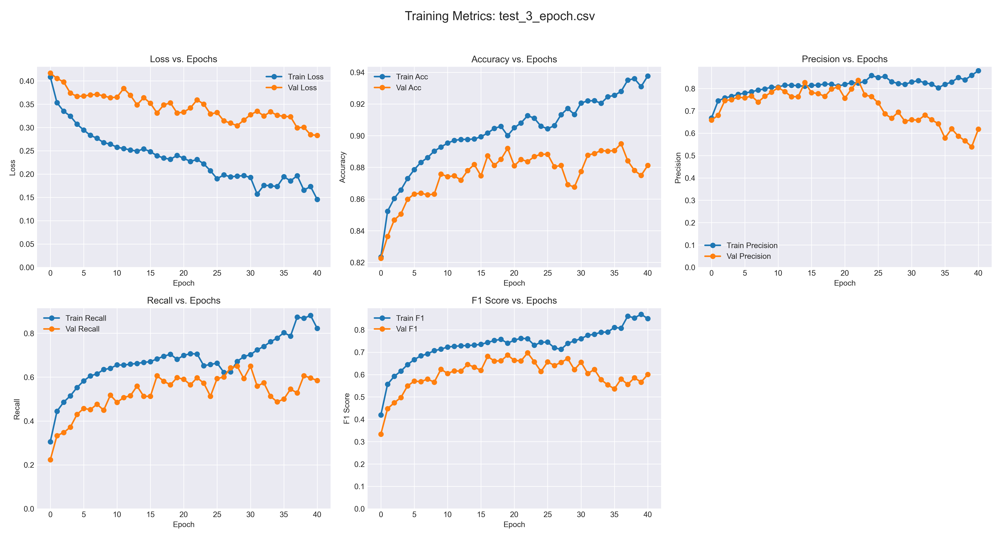

# EfficientPIE — Pedestrian Intent Prediction for Autonomous Vehicles

**CS766 Computer Vision Final Project** · University of Wisconsin–Madison  
Aditya Kumar · Amogh Sudhir Dixit · Jahnavi Sunchu

---

## Overview

A pedestrian stepping off a curb at 30 mph is already inside a vehicle's stopping distance — the reaction window is **≈ 0.89 seconds**. This project investigates whether EfficientPIE (IJCAI 2025), a real-time single-frame intent classifier, actually attends to the *pedestrian* or exploits brittle scene shortcuts, and proposes VLM-guided knowledge distillation as a fix.

**Task:** Given a single 300×300 RGB crop centered on a pedestrian, predict *will cross* / *won't cross* in real time.

---

## Key Findings

### 1. Accuracy misleads on an imbalanced test set
The JAAD test split contains **1,584 non-crossing vs 292 crossing** samples. A model that ignores crossers still scores ~84% accuracy. Our reproduction achieves **88.3% accuracy but only 64% recall on crossing**, exposing the real failure mode.

```
Confusion Matrix (n=1876)
               Predicted
               NC      C
Actual  NC   1470    114
        C     105    187
```

### 2. Scale Paradox — the model fails on close pedestrians
Pedestrian bounding-box area was used as a proxy for distance. Performance stratified into quintiles:

| Quintile | Bbox area (proxy) | Accuracy | F1 | Mean Confidence |
|----------|-------------------|----------|----|-----------------|
| Q1 (farthest) | smallest | 0.884 | 0.30 | low |
| Q2 | — | 0.917 | — | — |
| Q3 | — | 0.961 | — | — |
| Q4 | — | 0.944 | — | — |
| Q5 (closest) | largest | **0.765** | **low** | **high** |

The model makes its worst errors on the closest pedestrians **with high confidence** — exactly the safety-critical cases. The missing signal is not in the crop; the crop loses surrounding scene context when the pedestrian fills the frame.

### 3. Spatial Ablation — the pedestrian body is irrelevant

11 masking conditions were applied to every test image:

| Condition | F1 |
|-----------|-----|
| None (baseline) | **0.631** |
| Context only (pedestrian removed) | 0.457 |
| Pedestrian only (background removed) | **0.064** ← near chance |
| Top half masked | 0.549 |
| Bottom half masked | 0.501 |
| Random 10% occluded | 0.584 |
| Random 75% occluded | 0.491 |

Removing the pedestrian body entirely drops F1 to near chance. Keeping only the background context preserves ~70% of baseline performance. **EfficientPIE classifies crossing by reading the scene, not the person.**

### 4. Grad-CAM++ confirms scene exploitation
Attention heatmaps consistently show the pedestrian body as "cold" (blue). The model locks onto background features: rooflines, parked cars, curb boundaries, and road texture.

### 5. No demographic bias found
Stratifying errors across age (young / senior / child / adult), gender, and group size showed no statistically significant performance gaps. The failure mode is **environmental**, not demographic.

### 6. VLM Knowledge Distillation — partial fix
To force the student to learn principled scene semantics, CLIP ViT-B/32 was run offline on full uncropped JAAD frames:

```
L = L_task  +  α × L_distill
    (CrossEntropy)   (MSE: student projector vs CLIP embedding)
    α = 0.5
```

- **Student:** EfficientPIE with frozen backbone + 1280→1024→768 MLP projector  
- **Teacher:** CLIP ViT-B/32 (offline, full scene, zero inference-time cost)

**Result:** Accuracy, F1, and Recall were **unchanged**. Grad-CAM++ shows sharper, more architecturally-grounded background attention (rooflines, building edges), but the pedestrian remains invisible to the model. CLIP's general image–text pretraining can be satisfied by background templates alone — a pedestrian-specific VLM teacher (e.g., LLaVA prompted with crossing-intent questions) is needed.

---

## Architecture

EfficientPIE is a purely convolutional, single-frame classifier with no recurrent components (Qu et al., IJCAI 2025):

> *"EfficientPIE focuses on exploiting implicit feature of pedestrians and local context effectively, excluding extra modalities and images."*

```
Input 300×300 RGB
  → CommonConv (3→32, stride 2)
  → FusedMBConv block 1  (32→32, stride 1, no SE)
  → FusedMBConv block 2  (32→64, stride 2, no SE)
  → MBConv + SE  block 3 (64→128, stride 2, se_ratio=0.25)
  → MBConv + SE  block 4 (128→256, stride 2, se_ratio=0.25)
  → CommonConv   (256→1280, kernel 1)
  → GlobalAvgPool → Dropout(0.2) → Linear(1280→2)
```

All blocks use **depthwise separable convolutions**, reducing compute to ~1/9 of standard convolutions. MBConv blocks include **Squeeze-and-Excitation** channel attention. Reported inference: **0.21 ms/frame**.

The original paper also trains with two techniques on top of standard cross-entropy: **Intention Domain Incremental Learning (IDIL)**, which trains progressively across temporal subsets with an adaptive loss to prevent catastrophic forgetting, and **Progressive Perturbation**, which adds linearly increasing noise to output logits during backpropagation to exploit label uncertainty. Together these account for a ~5–6% accuracy improvement over the base model.

**Our training setup:**
- Optimizer: RMSProp, lr=1e-5, weight decay=1e-4, cosine annealing schedule
- Batch size: 32, Epochs: 40 (paper uses 50), Google Colab Pro GPU
- Augmentation: random horizontal flip, color jitter (brightness/contrast/saturation/hue)
- Normalization: mean=std=0.5 per channel

---

## Results

| Model | Accuracy | Precision | Recall | F1 | AUC |
|-------|----------|-----------|--------|----|-----|
| EfficientPIE (reported, JAAD) | 0.890 | 0.630 | — | 0.620 | 0.860 |
| **Ours (JAAD reproduction)** | **0.874** | **0.592** | **0.620** | **0.605** | **0.856** |
| Gap | −1.6% | −3.8% | — | −1.5% | −0.4% |

---

## Directory Structure

```
EfficientPIE/
├── models/
│   ├── EfficientPIE.py          # Model architecture
│   └── common.py                # ConvBNAct, FusedMBConv, MBConv, SqueezeExcite, DropPath
│
├── utils/
│   ├── jaad_data.py             # JAAD dataset API wrapper
│   ├── my_dataset.py            # PyTorch Dataset for standard training
│   ├── my_dataset_distill.py    # Dataset that loads CLIP embeddings alongside crops
│   ├── train_val.py             # train_one_epoch / evaluate loop
│   ├── train_val_distill.py     # Distillation training loop (L_task + α·L_distill)
│   ├── occlusion.py             # Occlusion masking at inference time
│   └── occlusion_augment.py     # Occlusion data augmentation during training
│
├── scripts/
│   ├── extract_vlm_features.py  # Offline CLIP embedding extraction
│   ├── run_occlusion_finetune.py
│   ├── plot_occlusion.py
│   ├── plot_finetune_comparison.py
│   └── verify_*.py              # Sanity-check utilities
│
├── weights/                     # Trained model checkpoints
│   ├── transfer_best_model_JAAD_best.pth   # Best EfficientPIE on JAAD (our training)
│   ├── transfer_best_model_distill.pth     # Best distilled model (CLIP teacher)
│   ├── transfer_best_model_JAAD.pth
│   └── transfer_min_loss_model_JAAD*.pth
│
├── pre_train_weights/           # ImageNet pretrained backbone weights
│   └── best_pretrained_model_imagenet_new.pth
│
├── weights_v8/                  # Incremental learning checkpoints (PIE dataset)
│   └── model_8_PIE_IL_step*.pth
│
├── results/
│   ├── scale_analysis/          # Scale-stratified accuracy plots and CSVs
│   ├── gradcam/                 # Grad-CAM++ on baseline model
│   ├── gradcam_fn/              # False-negative Grad-CAM samples
│   ├── gradcam_fp/              # False-positive Grad-CAM samples
│   ├── gradcam_*_distill/      # Same, for the distilled model
│   ├── verify/                  # Occlusion grid and augmentation sanity checks
│   ├── occlusion_plot.png
│   └── occlusion_results.csv
│
├── train_EfficientPIE_JAAD.py   # Main training script (JAAD)
├── train_EfficientPIE_JAAD_distill.py  # VLM distillation training
├── train_EfficientPIE.py        # Training script (PIE dataset)
├── test_EfficientPIE_JAAD.py    # Evaluation script (JAAD)
├── test_EfficientPIE_JAAD_occlusion.py # Occlusion ablation evaluation
├── test_EfficientPIE.py         # Evaluation script (PIE)
├── gradcam_inference_JAAD.py    # Grad-CAM++ visualization
├── run_scale_inference.py       # Scale-stratified inference and analysis
├── scale_visualize.py           # Scale failure grid plots
├── extract_images_parallel.py   # Fast JAAD video frame extraction
├── extract_images.py            # Single-process frame extraction
├── plot_metrics.py              # Training curve plotting
├── pie_domain_incremental_learning.py  # IDIL training on PIE
├── pretrain_imagenet.py         # ImageNet pretraining script
├── EfficientPIE_Colab_Workflow.ipynb   # End-to-end Colab notebook
│
├── Proposal.pdf
├── MidTerm_Report.pdf
└── Presentation_Slides.pdf
```

---

## Dataset Setup (JAAD)

```bash
# 1. Download JAAD video clips
wget http://data.nvision2.eecs.yorku.ca/JAAD_dataset/data/JAAD_clips.zip
unzip JAAD_clips.zip -d JAAD_videos

# 2. Clone JAAD annotations
git clone https://github.com/ykotseruba/JAAD.git

# 3. Move clips into the JAAD repo
mv JAAD_videos/JAAD_clips JAAD/

# 4. Extract frames (parallelized)
python extract_images_parallel.py
```

JAAD contains **346 video clips** from a front-facing dashboard camera, yielding **40,046 samples** after clipping at 0.5 overlap. Each sample is a pedestrian track labeled *crossing* or *not-crossing*.

---

## Installation

```bash
python -m venv .venv
source .venv/bin/activate
pip install torch torchvision torchaudio
pip install pillow tqdm tensorboard thop
# For VLM distillation:
pip install openai-clip
```

---

## Training

**Standard training on JAAD:**
```bash
python train_EfficientPIE_JAAD.py \
    --data-path ./JAAD \
    --epochs 40 \
    --batch-size 32 \
    --lr 1e-5 \
    --device cuda
```

**VLM Knowledge Distillation (requires CLIP embeddings pre-extracted):**
```bash
# Step 1: extract CLIP embeddings offline
python scripts/extract_vlm_features.py --data-path ./JAAD

# Step 2: train with distillation loss
python train_EfficientPIE_JAAD_distill.py \
    --data-path ./JAAD \
    --epochs 40 \
    --batch-size 32 \
    --weights weights/transfer_best_model_JAAD_best.pth \
    --device cuda
```

TensorBoard logs are written to `runs/`. View with:
```bash
tensorboard --logdir=runs
```

---

## Evaluation

**Standard evaluation:**
```bash
python test_EfficientPIE_JAAD.py \
    --data-path ./JAAD \
    --weights weights/transfer_best_model_JAAD_best.pth \
    --device cuda
```

**Occlusion ablation (11 masking conditions):**
```bash
python test_EfficientPIE_JAAD_occlusion.py \
    --data-path ./JAAD \
    --weights weights/transfer_best_model_JAAD_best.pth \
    --device cuda
```

**Scale-stratified analysis:**
```bash
python run_scale_inference.py \
    --data-path ./JAAD \
    --weights weights/transfer_best_model_JAAD_best.pth
```

---

## Grad-CAM++ Visualization

```bash
python gradcam_inference_JAAD.py \
    --data-path ./JAAD \
    --weights weights/transfer_best_model_JAAD_best.pth \
    --device cuda
```

Outputs are saved to `results/gradcam/` with filenames encoding ground truth, prediction, and correctness (e.g., `sample_0193_gt-crossing_pred-not_crossing_WRONG.png`). Distilled model outputs go to `results/gradcam_*_distill/`.

---

## Analysis Plots

### Training Curves (40 epochs on JAAD)

The model trains stably with steady improvement across all metrics. Validation accuracy plateaus around epoch 25, consistent with the original paper's convergence behavior.



### Scale Analysis

The bar chart below (from `results/scale_analysis/`) shows accuracy and F1 stratified by bounding-box area quintile (Q1=farthest, Q5=closest). The red line tracks mean confidence — highest exactly where accuracy collapses.

`results/scale_analysis/analysis_repo_protocol/plots/06_scale_accuracy_curve.png`

### Occlusion Ablation

`results/occlusion_plot.png` — F1 score under 11 spatial masking conditions, from full input down to context-only and pedestrian-only crops.

### Grad-CAM++ Samples

`results/gradcam/` — Side-by-side original image and attention heatmap for correct/incorrect predictions. Key observation: the pedestrian body is consistently cold (blue) across all prediction categories.

---

## Pretrained Weights

| File | Description |
|------|-------------|
| `weights/transfer_best_model_JAAD_best.pth` | Best EfficientPIE checkpoint trained on JAAD (88.3% acc) |
| `weights/transfer_best_model_distill.pth` | Best distilled model (CLIP ViT-B/32 teacher) |
| `pre_train_weights/best_pretrained_model_imagenet_new.pth` | ImageNet pretrained backbone |
| `weights_v8/model_8_PIE_IL_step*.pth` | Incremental learning checkpoints on PIE dataset |

---

## Future Work

1. **Scene-Balanced Dataset** — Ensure each filming location appears in both crossing and non-crossing conditions, decorrelating scene type from crossing label. Forces the model to find genuine behavioral signal rather than location shortcuts.

2. **Pedestrian-Grounded VLM Distillation** — Replace CLIP with a domain-aware VLM (e.g., LLaVA) prompted with pedestrian-specific questions: *"Is this person at a crosswalk?"*, *"Are they facing the road?"*, *"Are they near a curb?"*. A pedestrian-grounded teacher produces a distillation signal the student cannot satisfy with background context alone.

---

## References

1. Qu et al., *EfficientPIE: real-time prediction on pedestrian crossing intention with sole observation*, IJCAI 2025.
2. Munir et al., *Pedestrian Vision Language Model for Intentions Prediction*, IEEE OJITS 2025.
3. Liu et al., *Spatiotemporal Relationship Reasoning for Pedestrian Intent Prediction*, IEEE RA-L 2020.
4. Rasouli et al., *PIE: A Large-Scale Dataset and Models for Pedestrian Intention Estimation*, ICCV 2019.
5. Kotseruba et al., *Joint Attention in Autonomous Driving (JAAD)*, arXiv 2016.
6. Hu et al., *Squeeze-and-Excitation Networks*, IEEE TPAMI 2019.
